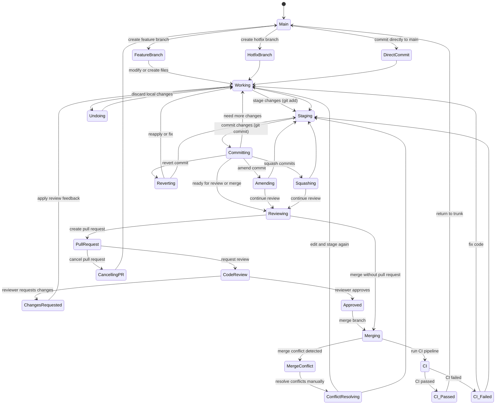

# Useful Git Stuff


A compact guide to mastering Git through essential commands, common pitfalls, time-saving shortcuts, expert tips, workflow patterns, and interview preparation.

1. Most used commands
2. Popular issues
3. Well known hotkeys
4. Some tips and tricks
5. Trunc based guide FSM
6. Commit Convention
7. Interview questions
8. Creating pull requests

> [!NOTE]
> It's really that simple — it covers everything you need to know about Git!

## Most Used Commands

These Git commands follow the typical development workflow—from starting a project to sharing changes. Learning them covers most daily Git usage and boosts your productivity. Ordered by typical workflow.

### 1. `git init`  
Initializes a new Git repo in the current directory.

```bash
git init
```

### 2. `git clone`  
Copies an existing remote repo to your local machine.

```bash
git clone <repo-url>
```

### 3. `git status`  
Shows the current state of your workdir.

```bash
git status
```

### 4. `git add`  
Stages changes, telling Git which files to include in the next commit.

```bash
git add <file>   # Add a specific file  
git add .        # Add all changes
git add -A       # Add all changes, including deletions
```

### 5. `git diff`  
Shows the difference files.

```bash
git diff            # Compare working directory to staging  
git diff --staged   # Compare staging to last commit
git diff <file>     # Compare files
```

### 6. `git commit`  
Creates a snapshot of the staged changes with a descriptive message. 

```bash
git commit -m "Commit Header" -m "Commit body"
```

### 7. `git log`  
Displays the history of commits in the current branch.  

```bash
git log
```

### 8. `git branch`  
Lists, creates, or deletes local branches. 

```bash
git branch -a           # List branches  
git branch <name>       # Create a new branch  
git branch -d <name>    # Delete a branch
```

### 9. `git checkout`  
Switches to another branch or restores file changes.

```bash
git checkout <branch>       # Switch to a branch(creates if not exists)
git checkout -b <name>      # Create and switch to a new branch  
git checkout -- <file>      # Discard local changes
```

### 10. `git merge`  
Merge selected branch(its files) into current(`git branch`).

```bash
git merge <branch>
```

### 11. `git pull`  
Fetches the latest changes from the remote and merges them into current branch.

```bash
git pull
```

### 12. `git push`  
Sends local branch changes to the remote repo.

```bash
git push origin <branch>
```

## Common Issues and Fixes
Mistakes happens, so this section covers common problems and best solutions for each case.

### 1. Wrong User Name or Email
**Issue:** Commits are showing the wrong author name/email.

```bash
git config --global user.name "Your Name"
git config --global user.email "you@example.com"
```

If it's a local repo-specific setting:
```bash
git config user.name "Your Name"
git config user.email "you@example.com"
```

### 2. Forgot to Add some Files into Commit
**Issue:** Commit created, but some changes weren’t added.

```bash
git add . # add more changes
git commit --amend --no-edit
```

### 3. Committed to the Wrong Branch
**Issue:** You made changes on `main` instead of a feature branch.

```bash
git checkout -b feature-branch
# or if the branch already exists
# git checkout feature-branch
git cherry-pick <commit_hash>
```

### 4. Merge Conflicts
**Issue:** Conflicts when merging branches.

Git will highlight conflicts in the files. Manually edit them(Some IDEs may help a lot), then:

```bash
git add <resolved-files>
git commit
```

Use tools like `git mergetool` for assistance.

### 5. Accidentally Deleted a File
**Issue:** Deleted a file you didn’t mean to.

```bash
git checkout HEAD -- <file>
```

### 6. Overwritten Local Changes with Pull
**Issue:** You pulled changes and lost your uncommitted local changes.

If not staged:
```bash
git fsck --lost-found
```

For safety, stash changes before pulling:
```bash
git stash
```

### 7. Large File Accidentally Committed
**Issue:** Accidentally added a large file to Git history.

Use `BFG Repo-Cleaner` or `git filter-branch`.


### 8. Need to Undo Last Commit
**Issue:** Last commit has a mistake.

```bash
git reset --soft HEAD~1  # Keeps changes
```

To discard the commit and changes:
```bash
git reset --hard HEAD~1
```

### 9. Forgot to Switch Branch Before Work
**Issue:** You made changes on the wrong branch.

```bash
git stash
git checkout correct-branch
git stash pop
```
### 10. Lost Commits After Rebase
**Issue:** Commits disappeared after a rebase.

```bash
git reflog
# Find the commit and recover:
git checkout <commit>
```

### 11. Differences in Line Endings (Windows vs Linux)
**Issue:** Files keep showing as changed due to line endings.

Add `.gitattributes` with following line:

```
* text=auto
```

Or set config:

```bash
git config --global core.autocrlf true   # Windows
git config --global core.autocrlf input  # Linux
```

### 12. Accidentally Stashed and Lost Work
**Issue:** You ran `git stash` and now your changes are gone.

```bash
git stash list
git stash pop stash@{0}  # or use apply to keep stash
git stash apply stash@{0}
```

### 13. Need to Revert a Pushed Commit
**Issue:** A bad commit has already been pushed.

```bash
git revert <commit_hash>
```
Creates a new commit that undoes the bad one.

### 14. Too Many Small Commits
**Issue:** You want to combine multiple commits into one.

```bash
git rebase -i HEAD~<n> # where <n> amount of commits
```

### 15. Push Rejected Due to Out-of-Date Branch
**Issue:** Remote has changes you don't.

```bash
git pull --rebase
git push
```

### 16. Need to Rename a Branch
**Issue:** The branch name is incorrect.

```bash
git branch -m new-name
git push origin :old-name new-name
```

### 17. Working on Wrong Base Branch
**Issue:** Your feature branch was created from the wrong base.

```bash
git rebase --onto correct-base wrong-base feature-branch
```

### 18. Deleted a Branch by Mistake
**Issue:** You deleted a local or remote branch accidentally.

**Fix (local):**

```bash
git reflog
# Find the branch commit and recreate
```

**Fix (remote):**
Ask a teammate to push it again if needed.

### 19. Want to See File History
**Issue:** You want to track the changes made to a specific file.

```bash
git log -- <file>
git blame <file>
```

### 20. Detached HEAD State
**Issue:** You checked out a commit, not a branch.

```bash
git checkout -b new-branch  # To save your state
```
Or just checkout a branch to exit:
```bash
git checkout main
```

### 21. Files Are Committed, but Changes Don’t Appear After Pull
**Issue:** You committed files (e.g., configs or logs), but after pulling, changes don’t sync properly—likely because Git is tracking the file but ignoring internal changes.

**Cause:** The file was added before updating `.gitignore`, or line endings / file permissions confuse Git on some systems. Sometimes it may be useful if you want track the file but not its changes(lines).

- To force Git to track changes again:

```bash
git rm --cached <file>
git add <file>
git commit -m "Re-track file changes"
```
- Double-check `.gitattributes` and `.gitignore` to ensure nothing blocks updates.

## Essential Hotkeys
Here is a list of my shorcuts that i've using each day. It will improve your speed a lot but require some words to memorize.

This repo contains a file named `gc`. Add this into your PATH.
You can do this manyally or using gc_install.sh that must be executed via git bash terminal.

```shell
gc
Usage: git-cheat [option]

Mandatory arguments:

  --setup -s          --> git setup and configuration
  --init -i           --> creation of new project
  --add -a            --> adding files to git
  --delete -d         --> deleting files from git
  --commit -c         --> git commit helper
  --branch -b         --> git branching info
  --merge -m          --> git merging info
  --rebase -rb        --> git rebase info
  --update -u         --> updating current repo
  --stash -st         --> stashing in current repo
  --inspect -in       --> git inspection, log,show...
  --remote -r         --> git remote helper
  --patch -p          --> git patching helper
  --debug -dg         --> git debugging
  --email -e          --> git email helper
  --tags -t           --> git tags helper
  --reset -rs         --> git reset helper
  --conflict -cn      --> git conflict resolving helper
  --revert -rv        --> git reverting helper
  --fix-mistakes -f   --> fix mistakes in git
  --submodules -sm    --> git submodules helper
  --archive -ar       --> archive your repo

  --help -h ?         --> prints usage of git-cheat
  --version -v        --> prints version of git-cheat
```


## Tips and Tricks
Handy tricks to make you look like a seasoned Git expert—alias setups, stash magic, rebase powers, and much more.

* **Use Hooks for Automation**  
Use `.git/hooks/pre-commit` to auto-lint, format, or reject bad commits.  
```bash  
#!/bin/sh  
black .  
```  
  
* **Compare Any Two Commits (Not Just HEAD)**

```bash  
git diff <commit1> <commit2>  
```  
  
* **Show Pretty Commit History**
```bash  
git log --graph --oneline --decorate --all  
```  
Great for reviewing merges and diverging branches.  

* **Prune Deleted Remotes**

```bash  
git remote prune origin  
```  
Cleans up remote-tracking branches that no longer exist.  
  
* **Ignore Local Changes Without .gitignore**

```bash  
git update-index --assume-unchanged path/to/file  
```  
Keeps file tracked but ignores local changes.  

* **Temporarily Keep Changes Without Committing**  
```bash  
git stash push -m "partial work" path/to/file  
```  
Experienced users stash selectively—not everything at once.  
  
* **Clean All Untracked Files Including Ignored** 
```bash  
git clean -xfd  
```  

## Trunk-Based Workflow (FSM Guide)
A simplified Finite State Machine diagram to help you follow trunk-based development practices.



## Interview Questions
A categorized collection of real Git interview questions, sorted by experience level. Most are from actual interviews.

### 🟢 Beginner Level

#### 1. What is a Version Control System (VCS)?
A VCS tracks changes made by developers, maintaining code history, enabling bug fixes, new code additions, and easy restoration of previous working versions.

#### 2. What does `git status` do?
Shows the difference between the working directory and the index (staging area), helping track changes that are staged or unstaged.

#### 3. What does `git add` do?
Adds files or changes to the staging area (index) for the next commit. You can add all changes (`git add .`), specific files (`git add <file>`), or folders (`git add <folder>/`).

#### 4. What is the "Index" or "Staging Area"?
A temporary area where changes are formatted and reviewed before committing.

#### 5. How to create a Git repository?
Run `git init` in a project folder to create a `.git` directory and initialize the repository.

#### 6. What is the difference between `git remote` and `git clone`?
- `git remote`: Adds a named remote URL to an existing repository.
- `git clone`: Creates a new local repository by copying an existing remote one.

#### 7. What does `git stash` do?
Temporarily saves changes in the working directory to a stack, allowing branch switching without losing edits.

#### 8. How to delete a Git branch?
- Locally: `git branch -d <branch_name>`
- Remotely: `git push origin --delete <branch_name>`

---

### 🟠 Intermediate Level

#### 1. What is the `git reflog` command?
Tracks all changes in branch references (like commits, checkouts), helping recover lost branches or commits.

#### 2. What does a commit object contain?
- Snapshot of project files at a point in time.
- Reference to parent commit(s).
- Unique SHA-1 hash identifier.

####  3. What are Git config levels?
- **System**: Applies to all users on the system (`--system`).
- **Global**: Applies to the current user (`--global`).
- **Local**: Applies to the current repository (`--local`, default).

#### 4. What is a detached HEAD?
When HEAD points to a commit or tag instead of a branch, causing "floating" commits not linked to any branch. Avoid by creating a new branch from that commit (`git checkout -b <branch>`).

#### 5. What does `git annotate` do?
Shows line-by-line commit info for a file, indicating which commit introduced each line.

#### 6. Difference between `git stash apply` and `git stash pop`?
- `apply`: Applies stash but keeps it in the stash list.
- `pop`: Applies stash and removes it from the stash list.

#### 7. Difference between `git diff` and `git status`?
- `git diff`: Shows specific content changes between commits or working directory and index.
- `git status`: Shows which files are staged, unstaged, or untracked.

#### 8. Difference between `git pull` and `git fetch`?
- `git fetch`: Downloads changes but doesn’t merge.
- `git pull`: Fetches and merges changes (`git fetch + git merge`).

#### 9. Why is Git easy to work with?
- Powerful branching and merging.
- Distributed system with local and remote repos.
- Pull requests enable collaboration.
- Speeds up release cycles.

---

### 🟣 Advanced Level

#### 1. How to squash multiple commits into one?
Run `git rebase -i HEAD~N` to combine the last N commits into a single commit. Use carefully as it rewrites history.

#### 2. How to recover a deleted branch that was pushed remotely?
Use `git reflog` to find the last commit of the branch and recreate it by checking out that commit as a new branch.

#### 3. How to resolve Git conflicts?
- Identify conflicted files.
- Manually edit to resolve conflicts.
- Stage resolved files (`git add`).
- Commit the merge (`git commit`).
- Push changes.

#### 4. What command lists branches merged to master?
`git branch --merged` shows branches merged into the current branch. `--no-merged` shows unmerged branches.

#### 5. Best practice: amend a commit or create a new one?
Prefer creating a new commit to avoid losing history or mixing unrelated changes.

#### 6. How to revert a bad commit already pushed?
- Fix and commit new changes.
- Or use `git revert <bad_commit>` to create a new commit that undoes the bad one.

#### 7. What does `git cherry-pick` do?
Applies specific commits from one branch onto another, useful for backporting or selective changes.

---